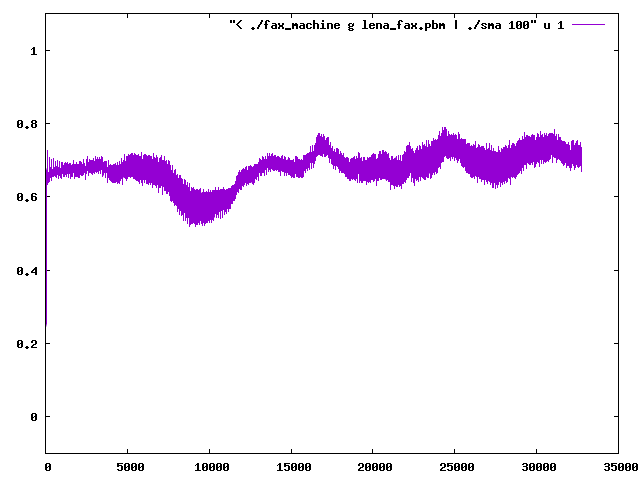
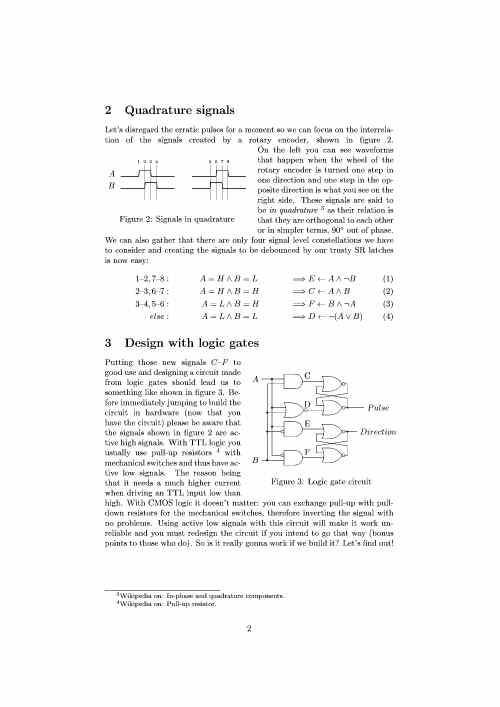
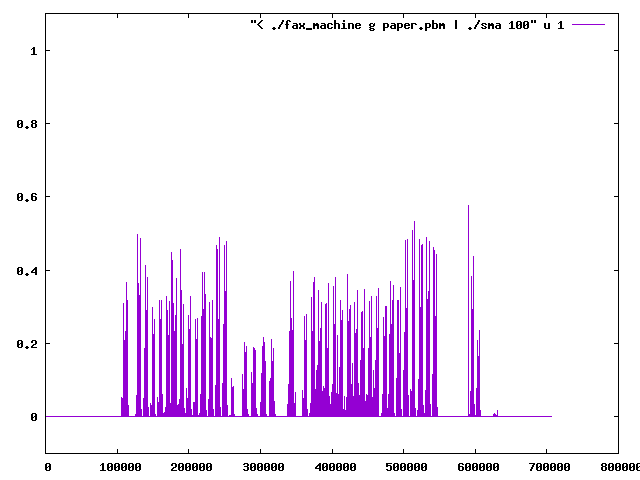
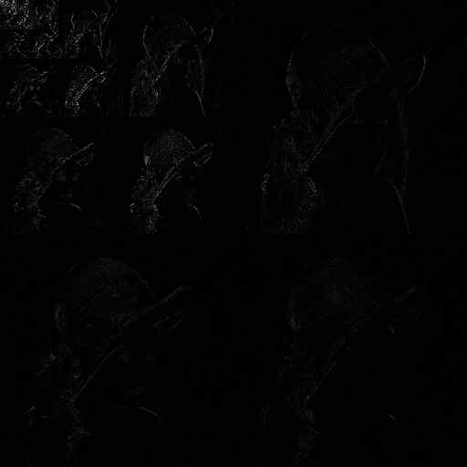
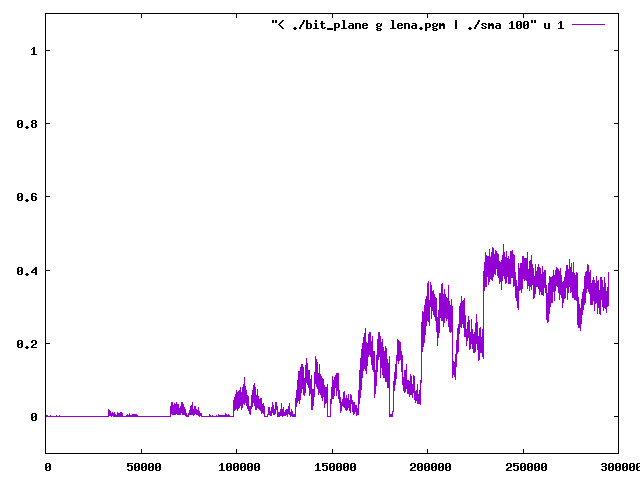
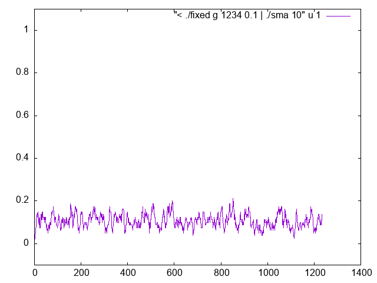
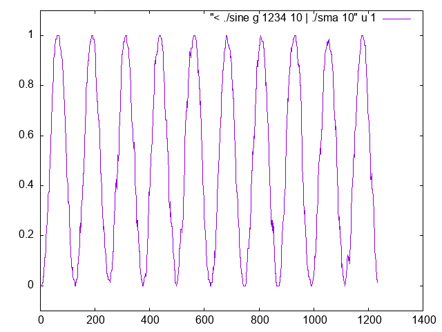

# Entropy coding compression challenge of various Bernoulli distributions
## About
The coders here are meant to be useful with binary streams, like those coming from [fax machines](https://en.wikipedia.org/wiki/Fax) or [bit planes](https://en.wikipedia.org/wiki/Bit_plane).
* copy: This is the `do nothing` coder
* rle_byte: Byte values between 1 and 254 are simply copied, while either 0 or 255 values are [run length encoded](https://en.wikipedia.org/wiki/Run-length_encoding) up to a run length of 256 bytes
* rle_zeros: We only encode the run length of bits with value zero using adaptive [Rice coding](https://en.wikipedia.org/wiki/Golomb_coding). This means that every bit with the value one gets encoded by a run length of zero zeros.
* rle_switch: We alternate back and forth [run length encoding](https://en.wikipedia.org/wiki/Run-length_encoding) sequences of zeros and ones. This way we only need to encode the run length. We use adaptive [Rice coding](https://en.wikipedia.org/wiki/Golomb_coding) for the lengths while alternating between two contexts.
* freq_varint: Currently the only non-streaming coder. We create a [histogram](https://en.wikipedia.org/wiki/Histogram) of byte values and use that to create a [permutation](https://en.wikipedia.org/wiki/Permutation) that maps frequent values to smaller values and encode those using a [variable length integer code](https://en.wikipedia.org/wiki/Universal_code_(data_compression)).
* arithmetic: We encode the current bit according to the past probability of some bits via [Arithmetic coding](https://en.wikipedia.org/wiki/Arithmetic_coding)

## Conclusion
`rle_switch` is a robust choice when the distribution of zeros and ones can change between extremes but is beaten by `rle_zeros` the moment we have more zeros than ones.
`rle_byte` is a solid choice if we need a simple byte based encoding and mostly deal with either lots of zeros or ones.
Last but not least, `arithmetic` is great for cracking the hard cases.

## Testing binary image of dithered lena image:
The binary image was created by applying [Floyd–Steinberg dithering](https://en.wikipedia.org/wiki/Floyd%E2%80%93Steinberg_dithering) to the grayscale image:

Dithering makes it possible to bring grayscale pictures to paper using various printing techniques. Unfortunately it also makes it hard to compress, as noise is intentionally introduced:

| Coder         | Change    |
| ------------- | --------- |
| copy          | 0%        |
| rle_byte      | +0.06%    |
| rle_zeros     | +23.94%   |
| rle_switch    | -4.90%    |
| freq_varint   | -0.20%    |
| arithmetic	| -13.32%   |

Nice to see that `arithmetic` here is able to achieve more with this tough data.

## Testing binary image of text:

Binary images of text on the other hand are easier to compress:

| Coder         | Change    |
| ------------- | --------- |
| copy          | 0%        |
| rle_byte      | -87.30%   |
| rle_zeros     | -89.69%   |
| rle_switch    | -92.20%   |
| freq_varint   | -81.23%   |
| arithmetic	| -86.53%   |

## Testing bit planes from a CDF53 transformed lena image:
The range of values after the transformation was -181 to 213. Inverting the negative values made it possible to store them as a one byte per pixel grayscale [PGM](https://en.wikipedia.org/wiki/Netpbm) image. The signs have been appended to the end of the [lena_cdf53.pgm](lena_cdf53.pgm) file, so the original transformation can be losslessly reconstructed.

As we go from the most significant to the least significant bit plane, our chances of getting long runs diminishes:

The last 1/8 of the plot shows the appended sign bits.

| Coder         | Change    |
| ------------- | --------- |
| copy          | 0%        |
| rle_byte      | -48.36%   |
| rle_zeros     | -55.83%   |
| rle_switch    | -54.14%   |
| freq_varint   | -37.92%   |
| arithmetic	| -57.03%   |

## Testing a fixed probability of 100% ones (0% zeros):
| Coder         | Change    |
| ------------- | --------- |
| copy          | 0%        |
| rle_byte      | -99.03%   |
| rle_zeros     | +0.97%    |
| rle_switch    | -99.51%   |
| freq_varint   | -87.14%   |
| arithmetic	| -95.06%   |

## Testing a fixed probability of 99% ones (1% zeros):
| Coder         | Change    |
| ------------- | --------- |
| copy          | 0%        |
| rle_byte      | -78.07%   |
| rle_zeros     | +0.97%    |
| rle_switch    | -90.61%   |
| freq_varint   | -82.61%   |
| arithmetic	| -90.21%   |

## Testing a fixed probability of 90% ones (10% zeros):
| Coder         | Change    |
| ------------- | --------- |
| copy          | 0%        |
| rle_byte      | +7.77%    |
| rle_zeros     | +8.25%    |
| rle_switch    | -41.34%   |
| freq_varint   | -38.92%   |
| arithmetic	| -48.95%   |

## Testing a fixed probability of 75% ones (25% zeros):
| Coder         | Change    |
| ------------- | --------- |
| copy          | 0%        |
| rle_byte      | +6.96%    |
| rle_zeros     | +15.53%   |
| rle_switch    | -2.27%    |
| freq_varint   | +24.03%   |
| arithmetic	| -16.02%   |

## Testing a fixed probability of 50% ones (50% zeros):
| Coder         | Change    |
| ------------- | --------- |
| copy          | 0%        |
| rle_byte      | +0.65%    |
| rle_zeros     | +15.45%   |
| rle_switch    | +15.45%   |
| freq_varint   | +82.69%   |
| arithmetic	| +2.59%    |

Simply copying the data, also known as `do nothing` works best if we are dealing with a uniform distribution where all symbols have the same probability of occuring. `rle_byte` also shows the property of resisting the urge to inflate the encoding.

## Testing a fixed probability of 25% ones (75% zeros):
| Coder         | Change    |
| ------------- | --------- |
| copy          | 0%        |
| rle_byte      | +7.12%    |
| rle_zeros     | -9.30%    |
| rle_switch    | -2.02%    |
| freq_varint   | +24.68%   |
| arithmetic	| -15.78%   |

## Testing a fixed probability of 10% ones (90% zeros):

| Coder         | Change    |
| ------------- | --------- |
| copy          | 0%        |
| rle_byte      | +10.36%   |
| rle_zeros     | -45.47%   |
| rle_switch    | -39.72%   |
| freq_varint   | -37.06%   |
| arithmetic	| -47.73%   |

## Testing a fixed probability of 1% ones (99% zeros):
| Coder         | Change    |
| ------------- | --------- |
| copy          | 0%        |
| rle_byte      | -74.43%   |
| rle_zeros     | -90.21%   |
| rle_switch    | -89.08%   |
| freq_varint   | -82.04%   |
| arithmetic	| -89.32%   |

## Testing a fixed probability of 0% ones (100% zeros):
| Coder         | Change    |
| ------------- | --------- |
| copy          | 0%        |
| rle_byte      | -99.03%   |
| rle_zeros     | -99.51%   |
| rle_switch    | -99.51%   |
| freq_varint   | -87.14%   |
| arithmetic	| -95.06%   |

## Testing a sinusoidal probability with 10 periods:

| Coder         | Change    |
| ------------- | --------- |
| copy          | 0%        |
| rle_byte      | -15.78%   |
| rle_zeros     | -13.27%   |
| rle_switch    | -33.41%   |
| freq_varint   | +7.93%    |
| arithmetic	| -41.59%   |

The bitstream coming from a [bit plane](https://en.wikipedia.org/wiki/Bit_plane) looks a bit more interesting than this sinusoidal probability but it is good enough to show the strength of `rle_switch` here. `arithmetic` is doing better still.

## References
* Run-length encodings  
Solomon W. Golomb - 1966
* Arithmetic Coding for Data Compression  
Ian H. Witten, Radford M. Neal, and John G. Cleary - 1987
* A Block-sorting Lossless Data Compression Algorithm  
M. Burrows and D.J. Wheeler - 1994

## YouTube
* [Data Compression (Summer 2020) -Lecture 15- Arithmetic Coding II (Infinite Precision in Finite Bits)](https://www.youtube.com/watch?v=WT57qXMpKjQ)
